<html>
<head>
<h1> Patterns </h1>
</head>
<body>
    <table border="2px solid black">
        <tr>
            <th>No.</th>
            <th>Pattern-Name</th>
            <th>Input</th>
            <th>Pattern</th>
        </tr>
        <tr>
            <td>1</td>
            <td> <a href="https://github.com/Abhishek-Pashte/Patterns-CPP/blob/main/Programs/Basic_Rectangle.cpp"> Basic-Rectangle </a> </td>
            <td>5 6</td>
            <td>
                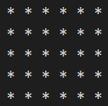
            </td>
        </tr>
        <tr>
            <td>2</td>
            <td> <a href="https://github.com/Abhishek-Pashte/Patterns-CPP/blob/main/Programs/Butterfly_Pattern.cpp"> Butterfly-Pattern </a> </td>
            <td>5</td>
            <td>
                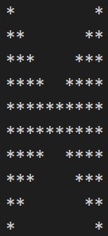
            </td>
        </tr>
        <tr>
            <td>3</td>
            <td> <a href="https://github.com/Abhishek-Pashte/Patterns-CPP/blob/main/Programs/Floyd_Triangle/Floyd_Triangle.cpp"> Floyd-Triangle </a> </td>
            <td>5</td>
            <td>
                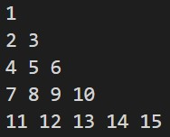
            </td>
        </tr>
        <tr>
            <td>4</td>
            <td> <a href="https://github.com/Abhishek-Pashte/Patterns-CPP/blob/main/Programs/Half_Pyramid_180deg.cpp"> Half-Pyramid-180Deg </a> </td>
            <td>5</td>
            <td>
                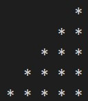
            </td>
        </tr>
        <tr>
            <td>5</td>
            <td> <a href="https://github.com/Abhishek-Pashte/Patterns-CPP/blob/main/Programs/Half_Pyramid_Using_Numbers.cpp"> Half-Pyramid-Using-Numbers </a> </td>
            <td>5</td>
            <td>
                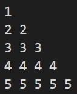
            </td>
        </tr>
        <tr>
            <td>6</td>
            <td> <a href="https://github.com/Abhishek-Pashte/Patterns-CPP/blob/main/Programs/Hollow_Rectangle.cpp"> Hollow-Rectangle </a> </td>
            <td>5</td>
            <td>
                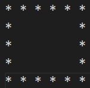
            </td>
        </tr>
        <tr>
            <td>7</td>
            <td> <a href="https://github.com/Abhishek-Pashte/Patterns-CPP/blob/main/Programs/Inverted_Half_Pyramid.cpp"> Inverted-Half-Pyramid </a> </td>
            <td>5</td>
            <td>
                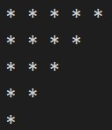
            </td>
        </tr><tr>
            <td>8</td>
            <td> <a href="https://github.com/Abhishek-Pashte/Patterns-CPP/blob/main/Programs/Palindromic_Pattern.cpp"> Palindromic Pattern </a> </td>
            <td>5</td>
            <td>
                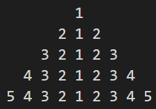
            </td>
        </tr>
        <tr>
            <td>9</td>
            <td> <a href="https://github.com/Abhishek-Pashte/Patterns-CPP/blob/main/Programs/0-1_Pattern.cpp"> 0-1-Pattern </a> </td>
            <td>5</td>
            <td>
                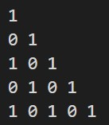
            </td>
        </tr>
        <tr>
            <td>10</td>
            <td> <a href="https://github.com/Abhishek-Pashte/Patterns-CPP/blob/main/Programs/Inverted_Pattern.cpp"> Inverted-Pattern </a> </td>
            <td>5</td>
            <td>
                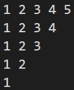
            </td>
        </tr>
        <tr>
            <td>11</td>
            <td> <a href="https://github.com/Abhishek-Pashte/Patterns-CPP/blob/main/Programs/Number_Pattern.cpp"> Number-Pattern </a> </td>
            <td>5</td>
            <td>
                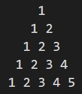
            </td>
        </tr>
        <tr>
            <td>12</td>
            <td> <a href="https://github.com/Abhishek-Pashte/Patterns-CPP/blob/main/Programs/Rhombus_Pattern.cpp"> Rhombus-Pattern </a> </td>
            <td>5</td>
            <td>
                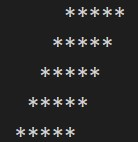
            </td>
        </tr>
        <tr>
            <td>13</td>
            <td> <a href="https://github.com/Abhishek-Pashte/Patterns-CPP/blob/main/Programs/Star_Pattern.cpp"> Star-Pattern </a> </td>
            <td>5</td>
            <td>
                
            </td>
        </tr>
        <tr>
            <td>14</td>
            <td> <a href="https://github.com/Abhishek-Pashte/Patterns-CPP/blob/main/Programs/Zig-Zag_Pattern.cpp"> Zig-Zag-Pattern </a> </td>
            <td>25</td>
            <td>
                
            </td>
        </tr>
      </table>
</body>
</html>
